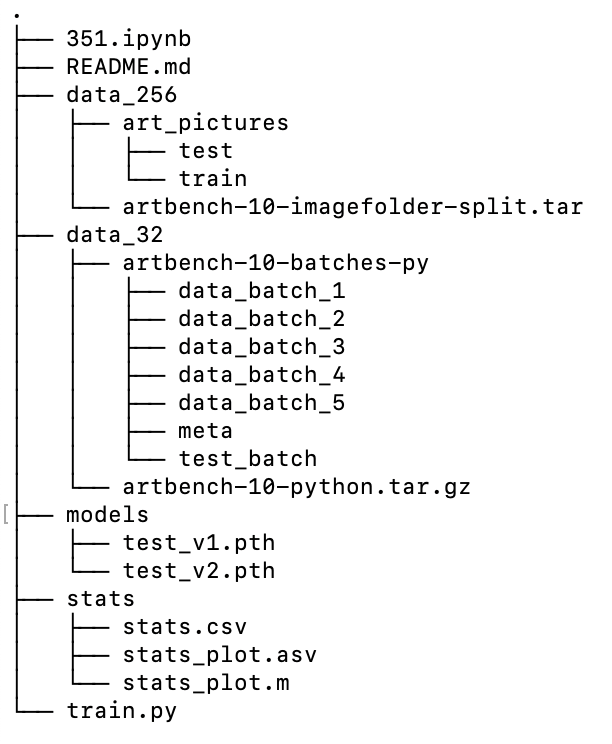

# Art Style Classifier With CNN (VGG16-BN)
Created and maintained by Joshua Ning  

## Getting Started
Download data from [artbench](https://github.com/liaopeiyuan/artbench)  
Use Conda Python 3.9.7  

### Dependencies:
1. matplotlib
2. torch
3. numpy
4. pandas
5. torchinfo

### File Structures
Only `351.ipynb` and `data_256` are required to start training  
The stats and models will be saved in the respective directories  
The train.py file is optimized for training only

