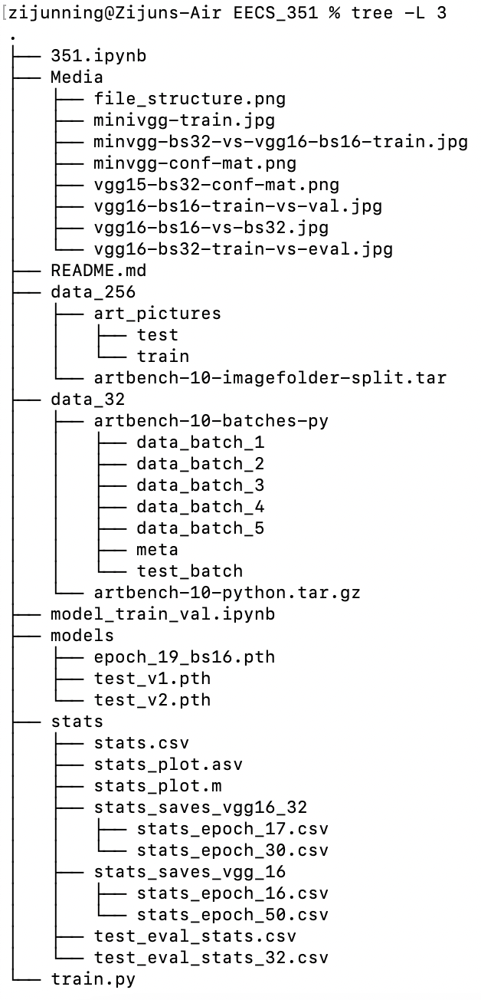

# Art Style Classifier With CNN (VGG16-BN)
Created and maintained by Joshua Ning  

## Getting Started
Download data from [artbench](https://github.com/liaopeiyuan/artbench)  
Download pre-trained model from [google drive](https://drive.google.com/file/d/1rv3zAzLSpKKHfyAWpPNBAD913jZzvPzB/view?usp=share_link) and move it into `/models`  
Use Conda Python 3.9.7  

## Dependencies:
1. matplotlib
2. torch
3. numpy
4. pandas
5. torchinfo
6. torchmetrics

## File Structures
Only `data_256` is required to start training  
`model_train_val.ipynb` can train and validate,is optimized for GPU with CUDA  
`351.ipynb` is a notebook with more documentation, essentially the same as `model_train_val.ipynb`  
`train.py` is a python script that can only train(for server)  
The stats and models will be saved in the respective directories  
The train.py file is optimized for training only

## Available models
1. `test_v1.pth` A small model from tutorial to test loading and saving data  
    Trained for 1 epoch, accuracy of 10%  
2. `test_v2.pth` mini-VGG BN  
    Trained for 3 epoch, batch size = 32, accuracy of 40%  
3. `epoch_19_bs16` VGG-16 BN  
    Trained for 19 epoch, batch size = 16, accuracy of 53.9%  

## Stats
1. `stats.csv` mini-VGG BN stats
2. `/stats_saves_vgg_16` VGG 16 batch size = 16 training stats
3. `/stats_saves_vgg16_32` VGG 16 batch size = 32 training stats
4. `test_eval_stats_32.csv` VGG 16 batch size = 32 evaluation stats
5. `test_eval_stats.csv` VGG 16 batch size = 16 evaluation stats
6. `stats_plot.m` Plot data with MATLAB

## Media
Plots and graphs generated throughout the project